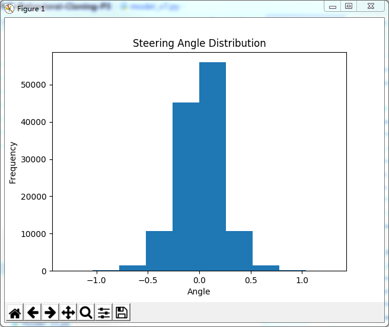
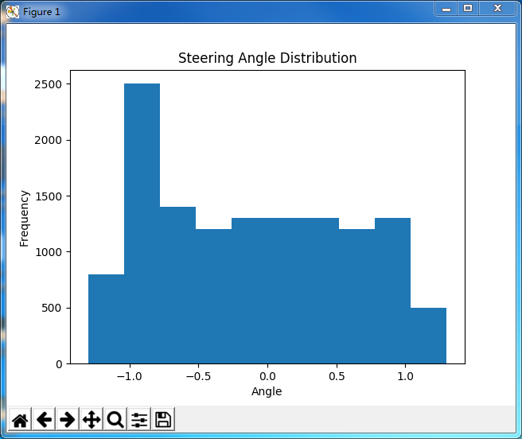
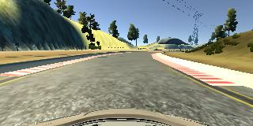
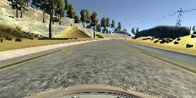
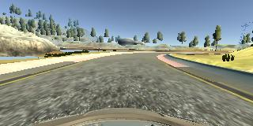
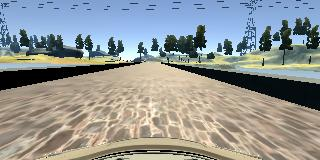

# **Behavioral Cloning**

---

**Behavioral Cloning Project**

The goals / steps of this project are the following:
* Use the simulator to collect data of good driving behavior
* Build, a convolution neural network in Keras that predicts steering angles from images
* Train and validate the model with a training and validation set
* Test that the model successfully drives around track one without leaving the road
* Summarize the results with a written report


## Rubric Points
### Here I will consider the [rubric points](https://review.udacity.com/#!/rubrics/432/view) individually and describe how I addressed each point in my implementation.

---
### Files Submitted & Code Quality

#### 1. Submission includes all required files and can be used to run the simulator in autonomous mode

My project includes the following files:
* model.py containing the script to create and train the model
* drive.py for driving the car in autonomous mode
* model.h5 containing a trained convolution neural network 
* writeup_report.md summarizing the results

#### 2. Submission includes functional code
Using the Udacity provided simulator and my drive.py file, the car can be driven autonomously around the track by executing 
```sh
python drive.py model.h5
```

#### 3. Submission code is usable and readable

The model.py file contains the code for training and saving the convolution neural network. The file shows the pipeline I used for training and validating the model, and it contains comments to explain how the code works.

### Model Architecture and Training Strategy

#### 1. An appropriate model architecture has been employed

My model consists of a convolution neural network with 5x5 or 3x3 filter sizes and depths between 16 and 64 (model.py lines 206-244)

The model includes RELU layers to introduce nonlinearity, and the data is normalized in the model using a Keras Lambda layer.

#### 2. Attempts to reduce overfitting in the model

The model contains two dropout layers with rate 0.5 to reduce overfitting(model.py lines 218 and 227).

The model was trained(80% data) and validated(20% data) on different data sets to ensure that the model was not overfitting (code line 301).
The model output model.h5 was tested by running it through the simulator and ensuring that the vehicle could stay on the track.

#### 3. Model parameter tuning

The model used an adam optimizer, so the learning rate was not tuned manually (model.py line 320).

#### 4. Appropriate training data

Training data was chosen to keep the vehicle driving on the road. I used a combination of the following data.
* 2 laps of clockwise driving
* 2 laps of counter-clockwise driving
* some additional curve driving
* some extra driving for problematic locations


We can see more data is around steering angle 0.




For details about how I created the training data, see the next section. 

### Model Architecture and Training Strategy

#### 1. Solution Design Approach

The overall strategy for deriving a model architecture was to start from the simplest one first. 
My first model was just a simple linear model. It was just to test if the model training worked and if it drove in the simulator. 
The first problem I encountered and I spent lots of time on it was that the model did not seem to drive in simulator. 
Thanks to the simple model, I eventually figured out the issue was I normalized image data outside the model in training but not included in drive.py, 
which I then corrected it by putting normalization into model via a Keras Lambda layer.

I then started with the existing model NVIDIA architecture, as it was approved to be a useful model in self driving car.

In order to gauge how well the model was working, I split my image and steering angle data into a training and validation set. 

To overcome over-fitting, I added some dropout layers in between with dropping rate of 0.5.

The final step was to run the simulator to see how well the car was driving around track one. There were a few spots where the vehicle fell off the track, specifically at curves and bridge area.
To improve the driving behavior in these cases, I captured more data on these areas. 
Meanwhile, I applied equally-distributed data generator strategy(lines 155-187), which produced a balance data, and use an alternating generator(lines 189-204) to alternate the batches between equally-distributed generator and normal generator(lines 107-128).
In this way, the output model became more generalized for both straight road conditions and other difficult conditions.


A more equally-distributed generator




I also reduced the number of trainable parameters to keep a reasonable size, currently at about 2M.

At the end of the process, the vehicle is able to drive autonomously around the track without leaving the road.

#### 2. Final Model Architecture

The final model architecture (model.py lines 206-244) consisted of a convolution neural network with the 5 convolutional layers and 4 full connected layers.

Here is a visualization of the architecture.
```
_________________________________________________________________
Layer (type)                 Output Shape              Param #
=================================================================
cropping2d_1 (Cropping2D)    (None, 90, 320, 3)        0
_________________________________________________________________
lambda_1 (Lambda)            (None, 90, 320, 3)        0
_________________________________________________________________
conv2d_1 (Conv2D)            (None, 86, 316, 16)       1216
_________________________________________________________________
dropout_1 (Dropout)          (None, 86, 316, 16)       0
_________________________________________________________________
max_pooling2d_1 (MaxPooling2 (None, 43, 158, 16)       0
_________________________________________________________________
activation_1 (Activation)    (None, 43, 158, 16)       0
_________________________________________________________________
conv2d_2 (Conv2D)            (None, 39, 154, 24)       9624
_________________________________________________________________
max_pooling2d_2 (MaxPooling2 (None, 20, 77, 24)        0
_________________________________________________________________
activation_2 (Activation)    (None, 20, 77, 24)        0
_________________________________________________________________
conv2d_3 (Conv2D)            (None, 16, 73, 36)        21636
_________________________________________________________________
dropout_2 (Dropout)          (None, 16, 73, 36)        0
_________________________________________________________________
max_pooling2d_3 (MaxPooling2 (None, 8, 37, 36)         0
_________________________________________________________________
activation_3 (Activation)    (None, 8, 37, 36)         0
_________________________________________________________________
conv2d_4 (Conv2D)            (None, 6, 35, 48)         15600
_________________________________________________________________
max_pooling2d_4 (MaxPooling2 (None, 3, 18, 48)         0
_________________________________________________________________
activation_4 (Activation)    (None, 3, 18, 48)         0
_________________________________________________________________
conv2d_5 (Conv2D)            (None, 1, 16, 64)         27712
_________________________________________________________________
activation_5 (Activation)    (None, 1, 16, 64)         0
_________________________________________________________________
flatten_1 (Flatten)          (None, 1024)              0
_________________________________________________________________
dense_1 (Dense)              (None, 100)               102500
_________________________________________________________________
dense_2 (Dense)              (None, 50)                5050
_________________________________________________________________
dense_3 (Dense)              (None, 10)                510
_________________________________________________________________
dense_4 (Dense)              (None, 1)                 11
=================================================================
Total params: 183,859
Trainable params: 183,859
Non-trainable params: 0
_________________________________________________________________
```

#### 3. Creation of the Training Set & Training Process

To capture good driving behavior, I first reused the two laps of clockwise driving from Udacity sample data. Here are some example images of clockwise driving.


I then recorded two laps of counter-clockwise driving to make the data more generalized. Here are some example images of counter-clockwise driving.




I also collected some curve samples and the locations where the model had problems. Here are one example image for each of the two scenarios.




To augment the data set, I used left and right images with center steering angle plus or minus a correction factor of 0.3 or 0.06. 
0.3 correction factor is used when center steering angle is greater than 0.05, and 0.06 otherwise. This leads to a more smooth driving.


Take center image with steering angle of 0.5(greater than 0.05) for example.


```
left_steering_angle = center_steering_angle + angle_correction_factor = 0.5 + 0.3 = 0.8
```


```
right_steering_angle = center_steering_angle - angle_correction_factor = 0.5 - 0.3 = 0.2
```

I also flipped each of the three kinds of images to make the data more generalized. The steering angle for flipped image is negated value of original image.

After the collection process, I had 19,852 lines of samples in my csv files. 
I then preprocessed this data by applying the above data augmentation, which transformed to 119,112 samples(19,852 * 6).


I finally randomly shuffled the data set and put 20% of the data into a validation set. 

I used this training data for training the model. The validation set helped determine if the model was over or under fitting. The ideal number of epochs was 11 as evidenced by the following training logs.

```
Epoch 1/50
787/787 [============================>.] - 307s - loss: 0.0417 - val_loss: 0.0292
Epoch 2/50
787/787 [============================>.] - 306s - loss: 0.0154 - val_loss: 0.0245
Epoch 3/50
787/787 [============================>.] - 305s - loss: 0.0123 - val_loss: 0.0210
Epoch 4/50
787/787 [============================>.] - 305s - loss: 0.0110 - val_loss: 0.0192
Epoch 5/50
787/787 [============================>.] - 305s - loss: 0.0104 - val_loss: 0.0180
Epoch 6/50
787/787 [============================>.] - 305s - loss: 0.0095 - val_loss: 0.0173
Epoch 7/50
787/787 [============================>.] - 305s - loss: 0.0092 - val_loss: 0.0161
Epoch 8/50
787/787 [============================>.] - 305s - loss: 0.0090 - val_loss: 0.0156
Epoch 9/50
787/787 [============================>.] - 305s - loss: 0.0086 - val_loss: 0.0158
Epoch 10/50
787/787 [============================>.] - 305s - loss: 0.0084 - val_loss: 0.0146
Epoch 11/50
787/787 [============================>.] - 305s - loss: 0.0082 - val_loss: 0.0144
Epoch 12/50
787/787 [============================>.] - 305s - loss: 0.0081 - val_loss: 0.0154
Epoch 13/50
787/787 [============================>.] - 305s - loss: 0.0078 - val_loss: 0.0145
```
The training stopped at 13th epochs, as there was no improvement on validation loss in 2 epochs - I applied a early stopping strategy with 1 patience. 
And the saved 11th epochs model, the final model I picked, performed well in autonomous mode. 
I used an adam optimizer so that manually training the learning rate wasn't necessary.
